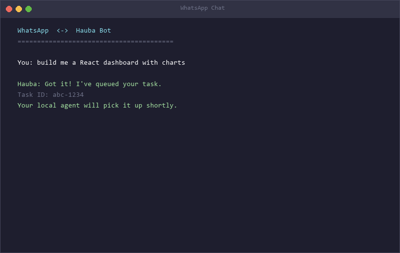
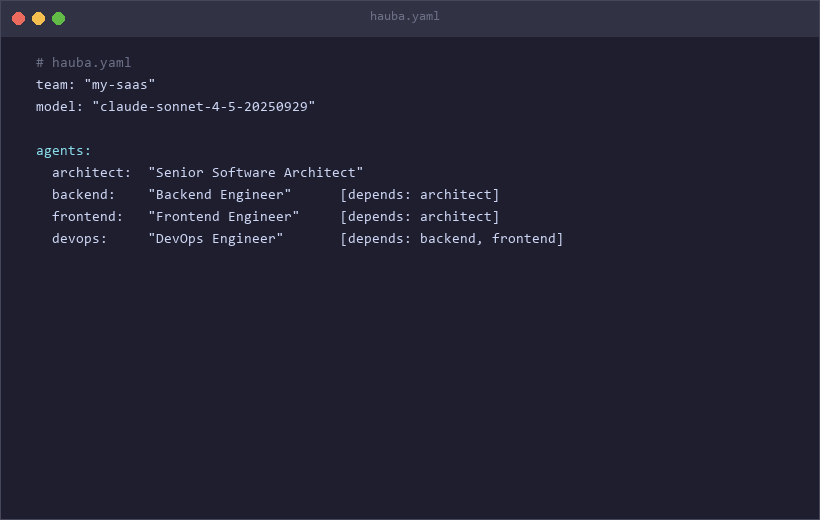
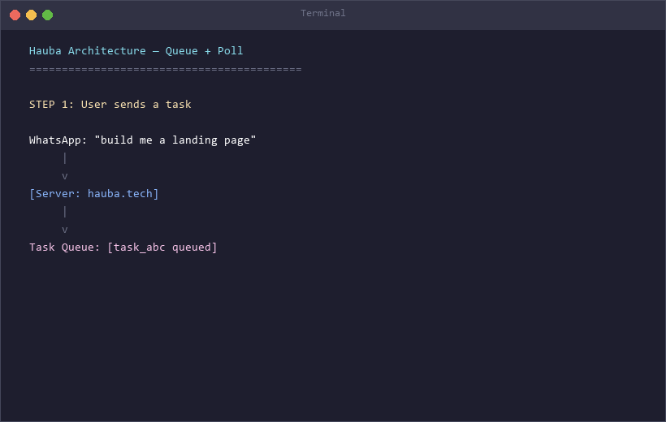

<p align="center">
  <br>
  <a href="https://hauba.tech">
    
  </a>
  <br>
  <br>
</p>

<h1 align="center">Stop hiring engineers.<br>Start shipping products.</h1>

<p align="center">
  <strong>An AI engineering company in your terminal. Not a chatbot.</strong><br>
  <sub>Powered by GitHub Copilot SDK &nbsp;·&nbsp; Open Source &nbsp;·&nbsp; MIT License</sub>
</p>

<p align="center">
  <a href="https://github.com/NikeGunn/haubaa/actions"></a>&nbsp;
  <a href="https://pypi.org/project/hauba/"></a>&nbsp;
  <a href="https://pypi.org/project/hauba/"></a>&nbsp;
  <a href="LICENSE"></a>&nbsp;
  &nbsp;
  
</p>

<p align="center">
  <a href="#-install">Install</a> &nbsp;&nbsp;·&nbsp;&nbsp;
  <a href="#-see-it-work">Demo</a> &nbsp;&nbsp;·&nbsp;&nbsp;
  <a href="#-capabilities">Features</a> &nbsp;&nbsp;·&nbsp;&nbsp;
  <a href="#-architecture">Architecture</a> &nbsp;&nbsp;·&nbsp;&nbsp;
  <a href="https://hauba.tech">Website</a> &nbsp;&nbsp;·&nbsp;&nbsp;
  <a href="https://pypi.org/project/hauba/">PyPI</a>
</p>

<br>

<p align="center">

```
pip install hauba && hauba init && hauba run "build me a SaaS"
```

</p>

<br>

---

<br>

One command gives you an AI team that plans architecture, writes production code, runs tests, fixes bugs, and delivers — while you sleep.

The same AI backbone used by GitHub. Now open-source and in your hands.

> **Your API key. Your machine. Zero platform cost.**
>
> We call this **BYOK** — Bring Your Own Key. The server is just a message queue. Builds always happen on your machine, with your credentials, under your control. Hauba charges nothing. Ever.

<br>

---

<br>

## Install

```bash
pip install hauba
```

| Platform | Command |
|:---------|:--------|
| **PyPI** | `pip install hauba` |
| **macOS / Linux** | `curl -fsSL https://hauba.tech/install.sh \| sh` |
| **Windows** | `irm hauba.tech/install.ps1 \| iex` |
| **Source** | `git clone https://github.com/NikeGunn/haubaa.git && cd haubaa && pip install -e ".[dev]"` |

<details>
<summary>Optional extras</summary>
<br>

```bash
pip install hauba[all]            # everything
pip install hauba[computer-use]   # browser + screen automation
pip install hauba[voice]          # voice mode (Whisper + TTS)
pip install hauba[web]            # web dashboard (FastAPI)
pip install hauba[channels]       # WhatsApp, Telegram, Discord
pip install hauba[services]       # email (SMTP)
```

</details>

**Requirements:** Python 3.11+ — nothing else. No Docker. No Redis. No Kubernetes.

<br>

## Quickstart

```bash
hauba init                                          # pick provider, paste key — 30 seconds
hauba run "build a SaaS dashboard with auth"        # it plans, you approve, it ships
```

```
$ hauba run "build a SaaS dashboard with auth"

  Thinking...
  Matched skills: full-stack-engineering, api-design, testing

  Plan
  ----
  1. Set up project structure
  2. Implement JWT authentication
  3. Build dashboard components
  4. Add Stripe billing integration
  5. Write test suite
  6. Verify all tests pass

  Proceed? [Y/n] y

  Executing (5/6)...
  [file] src/auth/handler.py          CREATED
  [file] src/billing/stripe.py        CREATED
  [bash] pytest tests/ -v             PASSED (12 tests)

  ✓ Task completed — 8 files created, 12 tests passing, 0 errors
```

Session stays open. Keep building:

```
> "add rate limiting and CORS"
> "write a Dockerfile for production"
> "deploy to Railway"
```

<br>

---

<br>

## See It Work

<table>
<tr>
<td width="50%" valign="top">

### Run a task

<sub>Think &rarr; Plan &rarr; Execute &rarr; Verify &rarr; Deliver</sub>

</td>
<td width="50%" valign="top">

### 30-second setup

<sub>Pick provider &rarr; Paste key &rarr; Ready to ship</sub>

</td>
</tr>
<tr>
<td width="50%" valign="top">

### 24/7 daemon agent

<sub>Polls &rarr; Claims &rarr; Builds locally &rarr; Notifies on phone</sub>

</td>
<td width="50%" valign="top">

### WhatsApp command center

<sub>Message bot &rarr; Queued &rarr; Built on your machine &rarr; Results delivered</sub>

</td>
</tr>
<tr>
<td width="50%" valign="top">

### Compose AI teams

<sub>Architect &rarr; Backend &#8741; Frontend &rarr; DevOps</sub>

</td>
<td width="50%" valign="top">

### Queue + Poll architecture

<sub>Your machine &harr; Server relay &harr; Channels</sub>

</td>
</tr>
</table>

<br>

---

<br>

## Capabilities

<table>
<tr>

<td valign="top" width="33%">

### Enterprise-Grade Engine
Powered by GitHub Copilot SDK — the same production-tested runtime behind Copilot. Not a wrapper around ChatGPT. The real agentic backbone.

</td>

<td valign="top" width="33%">

### BYOK — $0 Platform Cost
Bring Claude, GPT-4, or run fully offline with Ollama. Your key, your models. Server owner pays nothing. You control every dollar.

</td>

<td valign="top" width="33%">

### Air-Gap Ready
100% offline with Ollama. No telemetry. No cloud dependency. Deploy in classified environments, air-gapped networks, or just your laptop.

</td>

</tr>
<tr>

<td valign="top" width="33%">

### 17 Built-in Skills
Full-stack, ML, video editing, data pipelines, DevOps, security — domain expertise as composable `.md` files. TF-IDF matched to every task.

</td>

<td valign="top" width="33%">

### Ship via WhatsApp
Message your AI team from WhatsApp, Telegram, or Discord. Get results on your phone. 12 commands. Smart routing. Zero false positives.

</td>

<td valign="top" width="33%">

### Zero-Hallucination Ledger
SHA-256 hash chain + bit-vector + WAL. 5 verification gates. If the agent says it's done, it's cryptographically proven.

</td>

</tr>
</table>

<br>

---

<br>

## How It Works

**From idea to production in 3 steps.**

| Step | You Do | Hauba Does |
|:----:|--------|-----------|
| **1** | `pip install hauba && hauba init` | Sets up workspace, loads 17 skills |
| **2** | Describe what you want in plain English | Plans architecture, shows you for approval |
| **3** | Approve the plan | Writes code, runs tests, fixes bugs, delivers |

<br>

### Two modes of operation

**Local CLI** — you're at your computer:
```
hauba run "build me a landing page" → plans → you approve → builds → done
```

**Queue + Poll** — you're on your phone:
```
WhatsApp message → server queues it → your daemon picks it up
→ builds on YOUR machine with YOUR key → notifies you when done
```

```
┌─────────────────────┐         ┌─────────────────────┐
│   YOUR PHONE        │         │   YOUR MACHINE      │
│                     │         │                     │
│   WhatsApp          │         │   hauba agent       │
│   Telegram  ────────┼────►    │     ├─ poll         │
│   Discord           │  task   │     ├─ claim        │
│                     │  queue  │     ├─ build (BYOK) │
│   ◄─────────────────┼─────── │     └─ notify       │
│   "Done! 8 files"   │ result  │                     │
└─────────────────────┘         └─────────────────────┘
                    ▲                     │
                    │    hauba.tech       │
                    └──── (relay) ────────┘
```

**The server never sees your API key.** It's a stateless relay.

<br>

---

<br>

## Daemon Agent

Your AI engineer that runs 24/7. Never sleeps. Never takes PTO.

```bash
hauba agent --server https://hauba.tech
```

| | |
|:---|:---|
| **Polls** | Server every 10s for tasks from any channel |
| **Claims** | Auto-picks up queued tasks |
| **Builds** | Locally with your API key |
| **Reports** | Progress every 15s — live updates on your phone |
| **Tracks cost** | Alerts when spend exceeds $5 (configurable) |
| **Auto-retries** | Up to 3 attempts on failure |
| **Remote cancel** | Kill any task from WhatsApp mid-build |

<br>

---

<br>

## Channels

### WhatsApp · Telegram · Discord

Message your bot. Get results on your phone. 12 commands:

| Command | Effect |
|:--------|:-------|
| *"build me a dashboard"* | Queued for your daemon |
| `/tasks` | List tasks with live status |
| `/cancel <id>` | Cancel a running task |
| `/retry <id>` | Retry a failed task |
| `/web <url>` | Fetch + summarize any URL |
| `/email <to> <subj> \| <body>` | Send email |
| `/reply <msg\|off>` | Auto-reply mode |
| `/usage` | Cost and usage stats |
| `/status` | Health check |
| `/plugins` | Active plugins |
| `/feedback <msg>` | Send feedback |
| `/new` | Clear session |

Smart routing: build requests go to queue, chat gets instant responses.

```bash
hauba setup whatsapp    # interactive Twilio wizard
```

<br>

---

<br>

## Compose

`docker-compose` for AI agents. Define your team. Let them build.

```yaml
# hauba.yaml
team: "my-saas"
model: "claude-sonnet-4-5-20250929"

agents:
  architect:
    role: "Senior Software Architect"
    skills: [system-design, api-design]

  backend:
    role: "Backend Engineer"
    skills: [fastapi, auth, database]
    depends_on: [architect]

  frontend:
    role: "Frontend Engineer"
    skills: [nextjs, tailwind, react]
    depends_on: [architect]

  devops:
    role: "DevOps Engineer"
    skills: [docker, ci-cd, monitoring]
    depends_on: [backend, frontend]

output: "./output"
```

```bash
hauba compose up "build a SaaS with auth and Stripe billing"
```

Backend + frontend run **in parallel**. DevOps waits for both. Circular dependency detection built in.

<br>

---

<br>

## Skills

17 built-in. Human-readable `.md` files. Install your own.

<table>
<tr><td><code>full-stack-engineering</code></td><td>Complete SaaS builds — 6-milestone playbook</td></tr>
<tr><td><code>api-design-and-integration</code></td><td>REST, GraphQL, webhooks</td></tr>
<tr><td><code>code-generation</code></td><td>Multi-language, any framework</td></tr>
<tr><td><code>data-engineering</code></td><td>Pipelines, ETL, warehousing</td></tr>
<tr><td><code>data-processing</code></td><td>Cleaning, transformation, analysis</td></tr>
<tr><td><code>debugging-and-repair</code></td><td>Root cause analysis + fixes</td></tr>
<tr><td><code>devops-and-deployment</code></td><td>Docker, CI/CD, cloud infra</td></tr>
<tr><td><code>document-generation</code></td><td>Reports, docs, specs</td></tr>
<tr><td><code>image-generation</code></td><td>Image creation + processing</td></tr>
<tr><td><code>machine-learning</code></td><td>Training, eval, deployment</td></tr>
<tr><td><code>refactoring-and-migration</code></td><td>Code modernization</td></tr>
<tr><td><code>research-and-analysis</code></td><td>Deep research, synthesis</td></tr>
<tr><td><code>security-hardening</code></td><td>Audits, OWASP, hardening</td></tr>
<tr><td><code>testing-and-quality</code></td><td>Test suites, coverage, QA</td></tr>
<tr><td><code>video-editing</code></td><td>Trim, effects, subtitles</td></tr>
<tr><td><code>web-scraping</code></td><td>Data extraction at scale</td></tr>
<tr><td><code>automation-and-scripting</code></td><td>Workflow automation</td></tr>
</table>

```bash
hauba skill list                    # see all
hauba skill show full-stack         # inspect
hauba skill install ./custom.md     # add yours
hauba skill create my-skill         # scaffold
```

<br>

---

<br>

## TaskLedger

Zero trust. Full verification. Every task passes 5 cryptographic gates:

```
 GATE 1   PRE-EXECUTION       Ledger must exist before work begins
 GATE 2   DEPENDENCY           All upstream tasks VERIFIED
 GATE 3   COMPLETION           SHA256(prev_hash + task_id + artifact_hash)
 GATE 4   DELIVERY             Full gate check at every level
 GATE 5   RECONCILIATION       plan_count === ledger_count
```

Bit-vector state tracking. SHA-256 hash chain. Write-Ahead Log. Crash-safe. Tamper-evident.

<br>

---

<br>

## Plugins

Extend Hauba with async Python plugins. 7 lifecycle hooks.

```python
from hauba.plugins.base import BasePlugin

class MyPlugin(BasePlugin):
    name = "my-plugin"

    async def on_message(self, channel, sender, text):
        if "urgent" in text.lower():
            return "Prioritizing your task!"
        return None

    async def on_task_complete(self, task_id, output):
        ...  # your logic

def create_plugin():
    return MyPlugin()
```

```bash
hauba plugins install ./my_plugin.py
hauba plugins list
hauba plugins remove my-plugin
```

Hooks: `on_load` · `on_unload` · `on_message` · `on_task_complete` · `on_task_queued` · `on_startup` · `on_shutdown`

<br>

---

<br>

## Supported Models

| Provider | Models | Offline |
|:---------|:-------|:-------:|
| **Anthropic** | Claude Opus 4.6 · Sonnet 4.5 · Haiku 4.5 | — |
| **OpenAI** | GPT-4o · o3 | — |
| **Azure** | Any Azure OpenAI deployment | — |
| **Ollama** | Qwen 2.5 Coder · Llama 3 · any local model | **Yes** |

```bash
hauba config llm.provider anthropic
hauba config llm.model claude-sonnet-4-5-20250929
```

<br>

---

<br>

## Architecture

```
                    ┌───────────────────────────┐
                    │         CHANNELS           │
                    │  WhatsApp · Telegram       │
                    │  Discord · Voice · Web     │
                    └─────────────┬─────────────┘
                                  │
                           ┌──────▼──────┐
                           │   SERVER    │  hauba.tech
                           │  Task Queue │  relay only
                           │  Webhooks   │  zero builds
                           └──────┬──────┘
                                  │ poll 10s
                           ┌──────▼──────┐
                           │   DAEMON    │  your machine
                           │  CopilotSDK │  YOUR key
                           │  17 skills  │  TF-IDF match
                           │  TaskLedger │  SHA-256
                           └─────────────┘
```

<details>
<summary><strong>Source layout</strong></summary>

```
src/hauba/
├── cli.py                     # 20+ commands (Typer + Rich)
├── engine/copilot_engine.py   # Core — GitHub Copilot SDK
├── daemon/
│   ├── agent.py               # 24/7 polling daemon
│   └── queue.py               # Task queue with TTL + retry
├── channels/
│   ├── whatsapp_webhook.py    # WhatsApp bot (12 commands)
│   ├── telegram.py            # Telegram
│   ├── discord.py             # Discord
│   └── voice.py               # Whisper STT + edge-tts
├── skills/
│   ├── loader.py              # .md parser
│   └── matcher.py             # TF-IDF matching
├── plugins/                   # base · loader · registry
├── ledger/
│   ├── tracker.py             # bit-vector + hash chain
│   ├── wal.py                 # Write-Ahead Log
│   └── gates.py               # 5 verification gates
├── memory/store.py            # SQLite + TTL + compaction
├── services/
│   ├── email.py               # SMTP
│   └── reply_assistant.py     # auto-reply
├── tools/                     # bash · files · git · fetch · browser · screen
├── compose/                   # hauba.yaml parser + DAG runner
├── core/                      # config · constants · events
├── ui/                        # Rich terminal + FastAPI web
└── bundled_skills/            # 17 .md files
```

</details>

<details>
<summary><strong>Tech stack</strong></summary>

| | |
|:--|:--|
| Runtime | Python 3.11+ · asyncio |
| AI Engine | GitHub Copilot SDK |
| CLI | Typer · Rich |
| Storage | SQLite (aiosqlite) |
| Validation | Pydantic v2 |
| HTTP | httpx |
| Logging | structlog (JSON) |
| Web | FastAPI · WebSocket |
| Channels | Twilio · python-telegram-bot · discord.py |
| Voice | Whisper · edge-tts |
| Browser | Playwright |
| Quality | ruff · pyright · pytest |

</details>

<details>
<summary><strong>CLI reference — 20+ commands</strong></summary>

```
CORE
  hauba init                              setup wizard
  hauba run "task" [--no-interactive]     execute a task
  hauba status                            config + last task
  hauba doctor                            system diagnostics
  hauba logs [--lines 50]                 view logs
  hauba config <key> [value]              get/set config

DAEMON
  hauba agent [--server URL]              start 24/7 daemon
  hauba tasks [--server URL]              list tasks
  hauba cancel <task_id>                  cancel task
  hauba retry <task_id>                   retry task
  hauba usage                             cost summary

COMPOSE
  hauba compose up "task" [-f file]       run agent team
  hauba compose validate [-f file]        validate yaml

SKILLS
  hauba skill list                        list skills
  hauba skill show <name>                 inspect skill
  hauba skill install <path>              add skill
  hauba skill create <name>               scaffold skill

PLUGINS
  hauba plugins list                      list plugins
  hauba plugins install <path.py>         add plugin
  hauba plugins remove <name>             remove plugin

CHANNELS
  hauba setup whatsapp                    whatsapp wizard
  hauba email <to> <subj> [body]          send email
  hauba web <url>                         fetch url
  hauba reply <message|off>               auto-reply
  hauba feedback <message>                feedback

UI
  hauba voice                             voice mode
  hauba serve [--port 8420]               web dashboard
  hauba api [--port 8080]                 REST API
  hauba replay <id> [--speed 2]           replay session
```

</details>

<br>

---

<br>

## Deployment

Server runs at **[hauba.tech](https://hauba.tech)** on Railway. Handles webhooks and task queuing. All builds execute on user machines.

<details>
<summary><strong>Server environment variables</strong></summary>

```bash
TWILIO_ACCOUNT_SID=...
TWILIO_AUTH_TOKEN=...
TWILIO_WHATSAPP_NUMBER=whatsapp:+1...
HAUBA_LLM_API_KEY=...                  # server chat only
HAUBA_SMTP_HOST=smtp.gmail.com         # optional
```

</details>

<br>

## Testing

```bash
pytest tests/ -v                       # 432 tests, 0 failures
```

| Matrix | |
|:-------|:--|
| Ubuntu · macOS · Windows | All passing |
| Python 3.11 · 3.12 · 3.13 | All passing |
| ruff + pyright | All passing |

<br>

## Contributing

```bash
git clone https://github.com/NikeGunn/haubaa.git && cd haubaa
pip install -e ".[dev]" && pytest tests/ -v
```

Conventional commits: `feat:` · `fix:` · `refactor:` · `test:` · `docs:`

See [CONTRIBUTING.md](CONTRIBUTING.md).

<br>

---

<br>

<p align="center">
  <sub>MIT License — <a href="LICENSE">LICENSE</a></sub>
  <br><br>
  <strong>Stop hiring. Start shipping.</strong>
  <br><br>
  <a href="https://hauba.tech">Website</a> &nbsp;·&nbsp;
  <a href="https://pypi.org/project/hauba/">PyPI</a> &nbsp;·&nbsp;
  <a href="https://github.com/NikeGunn/haubaa/issues">Issues</a> &nbsp;·&nbsp;
  <a href="https://github.com/NikeGunn/haubaa/releases">Releases</a>
  <br><br>
  <sub>Built by <a href="https://github.com/NikeGunn">Nikhil Bhagat</a> and community &nbsp;·&nbsp; Powered by GitHub Copilot SDK</sub>
</p>
